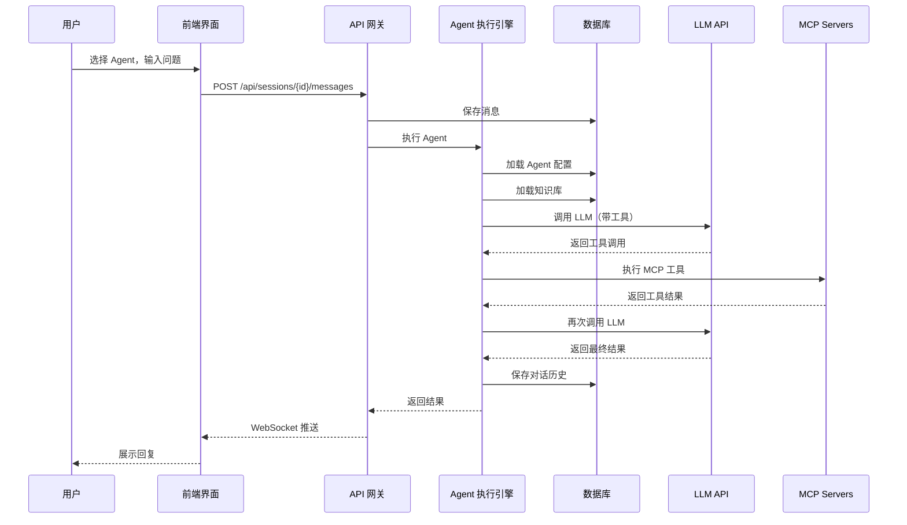
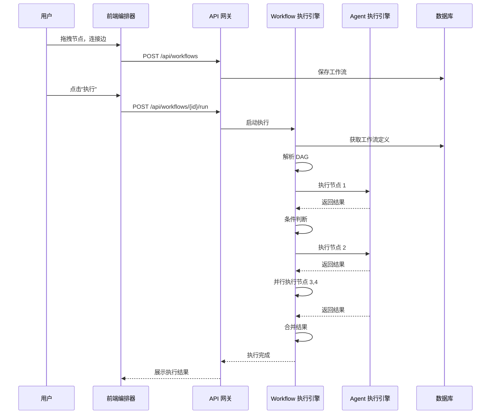

# 智能研发平台 v7.0 改造方案

## 一、架构总览

### 1.1 平台定位
对标 Hermes Agent，打造企业级 AI 研发平台：
- **Agent 执行中心**：直接对话/调用 Agent
- **Workflow 编排器**：可视化工作流设计
- **Skill 市场**：插件式能力扩展
- **知识库**：企业知识沉淀
- **沙箱环境**：容器化运行环境

### 1.2 技术架构

```
┌─────────────────────────────────────────────────────────────┐
│                      用户交互层                              │
│  ┌─────────┐  ┌─────────┐  ┌─────────┐  ┌─────────┐       │
│  │ Agent   │  │ Workflow│  │ Chat    │  │ Dashboard│      │
│  │ 执行界面 │  │ 编排器  │  │ 对话界面 │  │ 仪表盘  │      │
│  └────┬────┘  └────┬────┘  └────┬────┘  └────┬────┘       │
└───────┼─────────────┼─────────────┼─────────────┼──────────┘
        │             │             │             │
┌───────┴─────────────┴─────────────┴─────────────┴──────────┐
│                      API 网关层                              │
│  ┌─────────────────────────────────────────────────────┐   │
│  │ FastAPI + JWT Auth + Rate Limiting                  │   │
│  └─────────────────────────────────────────────────────┘   │
└────────────────────────┬──────────────────────────────────┘
                         │
┌────────────────────────┼──────────────────────────────────┐
│                      业务逻辑层                              │
│  ┌─────────┐  ┌─────────┐  ┌─────────┐  ┌─────────┐       │
│  │ Agent   │  │ Workflow│  │ Skill   │  │ Memory  │       │
│  │ 执行引擎 │  │ 编排引擎 │  │ 注册中心 │  │ 记忆引擎 │       │
│  └────┬────┘  └────┬────┘  └────┬────┘  └────┬────┘       │
└───────┼─────────────┼─────────────┼─────────────┼──────────┘
        │             │             │             │
┌───────┴─────────────┴─────────────┴─────────────┴──────────┐
│                      基础设施层                              │
│  ┌─────────┐  ┌─────────┐  ┌─────────┐  ┌─────────┐       │
│  │ SQLite  │  │ Podman  │  │ Agno    │  │ MCP     │       │
│  │ 持久化  │  │ 容器化  │  │ Agent   │  │ 工具层  │       │
│  └─────────┘  └─────────┘  └─────────┘  └─────────┘       │
└─────────────────────────────────────────────────────────────┘
```

## 二、核心场景流程

### 2.1 Agent 执行流程



### 2.2 Workflow 编排执行流程



## 三、详细设计

### 3.1 数据库扩展

```sql
-- 会话表
CREATE TABLE IF NOT EXISTS sessions (
    id TEXT PRIMARY KEY,
    agent_id TEXT NOT NULL,
    title TEXT,
    created_at TEXT DEFAULT CURRENT_TIMESTAMP,
    updated_at TEXT DEFAULT CURRENT_TIMESTAMP,
    FOREIGN KEY (agent_id) REFERENCES agents(id)
);

-- 消息表（扩展）
CREATE TABLE IF NOT EXISTS messages (
    id TEXT PRIMARY KEY,
    session_id TEXT NOT NULL,
    role TEXT NOT NULL,  -- user, assistant, system
    content TEXT NOT NULL,
    metadata TEXT,  -- JSON: tools_used, memory_updated, etc.
    created_at TEXT DEFAULT CURRENT_TIMESTAMP,
    FOREIGN KEY (session_id) REFERENCES sessions(id) ON DELETE CASCADE
);

-- 记忆表
CREATE TABLE IF NOT EXISTS memories (
    id TEXT PRIMARY KEY,
    session_id TEXT NOT NULL,
    agent_id TEXT,
    memory_type TEXT DEFAULT 'short',  -- short, long, protected
    content TEXT NOT NULL,
    created_at TEXT DEFAULT CURRENT_TIMESTAMP,
    updated_at TEXT DEFAULT CURRENT_TIMESTAMP,
    FOREIGN KEY (session_id) REFERENCES sessions(id) ON DELETE CASCADE
);

-- Workflow 执行历史
CREATE TABLE IF NOT EXISTS workflow_runs (
    id TEXT PRIMARY KEY,
    workflow_id TEXT NOT NULL,
    status TEXT DEFAULT 'pending',  -- pending, running, completed, failed
    input_data TEXT,
    output_data TEXT,
    started_at TEXT,
    completed_at TEXT,
    FOREIGN KEY (workflow_id) REFERENCES workflows(id) ON DELETE CASCADE
);

-- Workflow 节点执行日志
CREATE TABLE IF NOT EXISTS workflow_run_logs (
    id TEXT PRIMARY KEY,
    run_id TEXT NOT NULL,
    node_id TEXT NOT NULL,
    status TEXT DEFAULT 'pending',
    input_data TEXT,
    output_data TEXT,
    error TEXT,
    started_at TEXT,
    completed_at TEXT,
    FOREIGN KEY (run_id) REFERENCES workflow_runs(id) ON DELETE CASCADE
);
```

### 3.2 API 端点设计

#### Agent 执行 API
```
POST   /api/agents/{id}/run           # 执行 Agent
GET    /api/agents/{id}/sessions      # 获取 Agent 的会话列表
GET    /api/agents/{id}/sessions/{sid}/messages  # 获取会话消息
POST   /api/agents/{id}/sessions/{sid}/messages  # 发送消息
DELETE /api/agents/{id}/sessions/{sid}    # 删除会话
```

#### Workflow 执行 API
```
POST   /api/workflows                 # 创建工作流
GET    /api/workflows                 # 获取工作流列表
GET    /api/workflows/{id}            # 获取工作流详情
PUT    /api/workflows/{id}            # 更新工作流
DELETE /api/workflows/{id}            # 删除工作流
POST   /api/workflows/{id}/run        # 执行工作流
GET    /api/workflows/{id}/runs       # 获取执行历史
GET    /api/workflows/{id}/runs/{rid} # 获取执行详情
```

#### 记忆管理 API
```
GET    /api/memories                  # 获取记忆列表
POST   /api/memories                  # 创建记忆
PUT    /api/memories/{id}             # 更新记忆
DELETE /api/memories/{id}            # 删除记忆
GET    /api/memories/search?q=xxx     # 搜索记忆
```

### 3.3 前端页面设计

#### 3.3.1 Agent 执行界面
- 左侧：会话列表
- 中间：对话界面（支持 Markdown、代码块、文件预览）
- 右侧：Agent 详情、工具选择、记忆查看

#### 3.3.2 Workflow 编排器
- 画布：拖拽式节点编辑
- 节点类型：
  - Agent 节点：调用 Agent
  - HTTP 节点：调用外部 API
  - 条件节点：分支逻辑
  - 并行节点：并发执行
  - 工具节点：执行 MCP 工具
- 右侧面板：属性配置
- 顶部工具栏：执行、保存、导出

#### 3.3.3 会话管理界面
- 会话列表（支持搜索、筛选）
- 会话详情（消息历史、记忆快照）
- 会话操作（重命名、删除、导出）

## 四、代码架构

### 4.1 后端目录结构
```
backend/
├── main.py                 # 主应用入口
├── agents/
│   ├── executor.py         # Agent 执行引擎
│   ├── context.py          # Agent 上下文管理
│   └── memory.py           # Agent 记忆管理
├── workflows/
│   ├── executor.py         # Workflow 执行引擎
│   ├── validator.py        # 工作流验证
│   └── scheduler.py        # 工作流调度
├── sessions/
│   ├── manager.py          # 会话管理
│   └── history.py          # 消息历史
├── api/
│   ├── agents.py           # Agent API
│   ├── workflows.py        # Workflow API
│   ├── sessions.py         # 会话 API
│   └── memories.py         # 记忆 API
└── sandbox/
    └── manager.py          # 容器管理（已有）
```

### 4.2 前端目录结构
```
frontend/src/
├── pages/
│   ├── AgentExecutePage.jsx      # Agent 执行界面
│   ├── WorkflowEditorPage.jsx    # Workflow 编排器
│   ├── SessionsPage.jsx          # 会话管理
│   ├── MemoriesPage.jsx          # 记忆管理
│   └── ...
├── components/
│   ├── ChatInterface/            # 对话界面组件
│   ├── WorkflowCanvas/           # 工作流画布组件
│   ├── NodeEditors/              # 节点编辑器
│   └── ...
└── stores/
    ├── sessionStore.js           # 会话状态
    └── workflowStore.js          # 工作流状态
```

## 五、实施计划

### Phase 1: 基础架构（1-2 天）
- [ ] 数据库迁移（sessions, memories, workflow_runs）
- [ ] Agent 执行引擎核心逻辑
- [ ] 会话管理 API
- [ ] 基础对话界面

### Phase 2: 核心功能（2-3 天）
- [ ] Workflow 执行引擎
- [ ] Workflow 管理 API
- [ ] 记忆管理 API
- [ ] 会话列表界面

### Phase 3: 可视化编排（3-4 天）
- [ ] Workflow 编排器 UI
- [ ] 节点拖拽交互
- [ ] 执行结果展示
- [ ] 错误处理

### Phase 4: 优化完善（1-2 天）
- [ ] 性能优化
- [ ] 用户体验优化
- [ ] 文档完善

## 六、关键设计决策

| 决策点 | 选择 | 理由 |
|--------|------|------|
| Workflow 执行模式 | 同步 + 异步 | 简单场景同步，复杂场景异步 + WebSocket 推送 |
| 记忆存储 | SQLite + JSON | 与现有架构一致，避免引入新依赖 |
| 前端状态管理 | Zustand | 轻量级，适合中小型项目 |
| 工作流持久化 | JSON 存储 | 便于版本控制和迁移 |
| 实时推送 | WebSocket | 支持长时任务进度推送 |

## 七、风险与应对

| 风险 | 影响 | 应对措施 |
|------|------|----------|
| Workflow 复杂度高 | 开发周期长 | 先实现核心节点，逐步扩展 |
| 实时性能问题 | 用户体验差 | 分页加载、虚拟滚动 |
| 记忆膨胀 | 响应慢 | 智能摘要、定期清理 |

---
*方案版本: v7.0.0*
*创建日期: 2026-08-01*
